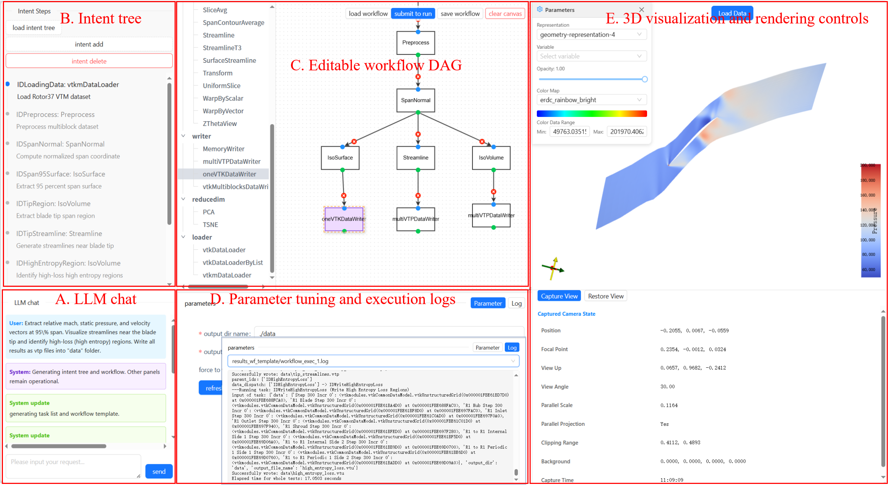

# Automated Workflow Generation for Scientific Visualization

This repository contains experimental results and source code for automated workflow generation in scientific visualization. The project explores using Large Language Models (LLMs) to generate visualization workflows based on natural language queries.

## Project Structure

```
automaingworkflow-github/
├── exp_1/                 # Experiment 1: Effects of External Knowledge
├── exp_2/                 # Experiment 2: Multi-stage Workflow Generation
└── workflow_generation_web/ # Web Interface for Workflow Visualization
```

---

## exp1: Effects of Adding External Information

### Overview
Experiment 1 investigates how different types of external knowledge affect the quality of LLM-generated visualization workflows.

### Configuration Combinations

The experiment tests five configurations with increasing levels of external knowledge:

| Configuration | Components | Description |
|--------------|------------|-------------|
| **EX** | Example workflows | Only uses workflow examples |
| **EX-R** | Examples + Rules | Adds workflow generation rules |
| **EX-R-OD** | Examples + Rules + Operator Descriptions | Adds operator documentation |
| **EX-R-OD-PD** | Examples + Rules + Parameter Descriptions | Adds parameter details (includes operator descriptions) |
| **EX-R-OD-PD-DATA** | Examples + Rules + Parameters + Data Description | Adds dataset metadata |

### External Knowledge Files

Located in `exp_1/external_knowledge/`:

- `prompt_wflow_example.md` - Example workflows for reference
- `prompt_wflow_rules.md` - Structured rules for workflow generation
- `filter_name_descriptions.json` - Operator/filter name descriptions
- `filter_parameter_descriptions.json` - Parameter descriptions for each operator
- `data_description.md` - VTK dataset analysis (Rotor37 data)

### Key Scripts

#### Experiment Running Scripts

| Script | Purpose |
|--------|---------|
| `run_exp_and_get_results.py` | **Core experiment script** - Calls LLM to generate workflows using different configuration combinations |
| `prepare_results_ana.py` | Prepares experimental results for analysis |
| `run_wf.py` | Runs generated workflows and obtains output results |
| `compare_diff.py` | Compares generated workflows with ground truth |

#### Figure Drawing Scripts

| Script | Purpose |
|--------|---------|
| `draw_figures.py` | Draws comparison bar charts for each hard case (added tasks, removed tasks, modified lines, connection changes), outputs `hardcases.png` |
| `figures_average.py` | Draws average metric comparison charts across 5 hard cases, including structural accuracy and overall similarity, outputs `average_metrics_comparison.png` |

### Results

Results are stored in `exp_1/results_260328/` and `exp_1/results_ana_260328/`:

- **Hard Cases**: 5 hard difficulty test cases
- **Workflow Files**: Generated YAML workflows for each configuration
- **Analysis Output**: Visualization results and comparison data


---

## exp2: Multi-stage Workflow Generation

### Overview
Experiment 2 explores a multi-stage approach to workflow generation, breaking the process into sequential stages for better control and accuracy.

### Stage Pipeline

1. **Stage 0**: Baseline workflow generation
2. **Stage 1**: Intent tree extraction and planning
   - Natural language planning (`nl_planning.py`)
   - DAG task generation (`dag_task.py`)
   - Connection pattern extraction (`conn_pattern_extraction/`)
3. **Stage 2**: Plan tree to workflow conversion
4. **Stage 3**: Workflow refinement and optimization

### Key Components

- `semantic_parser.py` - Parses natural language queries into structured intent
- `gen_plan_tree.py` - Generates planning trees from parsed intent
- `stage2_plan_tree_to_workflow.py` - Converts plan trees to executable workflows
- `compare_diff.py` - **Workflow comparison script** - Compares generated workflows with ground truth and calculates differences

### Results

- `stage0_results/` - Baseline generation results
- `results_stage1_plans/` - Stage 1 planning results
- `stage2_workflow_results/` - Final workflow generation results
- `results.txt` - **Summary results** containing evaluation metrics
- Various comparison charts (PNG files)

### Getting Results

To generate comparison results, run:

```bash
cd exp_2
python compare_diff.py
```

### Comparison Algorithm (`compare_diff.py`)

The script compares generated workflows against ground truth files using a **four-step normalization and comparison process**:

#### 1. ID Normalization (`normalize_workflow`)

- Maps original task IDs to a standardized format: `ID_<module_name>_<count>`
- Example: `IDLoadData` → `ID_vtkmDataLoader_1`
- Updates all output and data field references accordingly

#### 2. Structural Difference Detection

- **Added Tasks**: Tasks present in ground truth but missing from generated results
- **Removed Tasks**: Tasks present in generated results but missing from ground truth
- **Common Tasks**: Tasks present in both (require further comparison)

#### 3. Deep Difference Analysis

Compares common tasks item by item:

| Comparison Item | Detects |
|-----------------|---------|
| `from` field | Whether operator name is correct |
| `output` field | Whether output identifier is correct |
| `data` input | Whether data connections are correct (not counted in parameter differences) |
| Other parameters | Value differences for non-data parameters |

#### 4. Statistical Metric Calculation

- **Task-level differences**: Number of tasks with modified `from` names
- **Parameter-level differences**: Number of modified parameter lines (excluding data connections)
- **Connection-level differences**: Number of tasks with changed data connections

#### Output Results

- Console output: Detailed difference report including task count comparison and modification statistics
- Log file: `para_diff_log.txt` records specific parameter modifications for each task
- Result file: `results.txt` contains numerical evaluation metrics


---

## Web Interface

### Overview
The web interface provides an interactive platform for visualizing and managing generated workflows.

### Interface Preview



### Features

- **Workflow Visualization**: Drag-and-drop workflow editor
- **Natural Language Input**: Query-based workflow generation
- **Real-time Execution**: Execute workflows and view results
- **Parameter Configuration**: Adjust operator parameters interactively
- **Intent Tree Display**: Visualize parsed intent structures


### Project Structure

```
workflow_generation_web/
├── agents/           # LLM-based agents for workflow generation
├── assets/           # Static assets and styles
├── pages/            # Web page components
├── prompt/           # Prompt templates
├── utils/            # Utility functions and agents
├── main.py           # Backend entry point
└── config.py         # Configuration settings
```

---

## Dependencies

To obtain datasets and additional dependencies, please contact the author:

📧 **Email**: godenwangzhe@gmail.com
